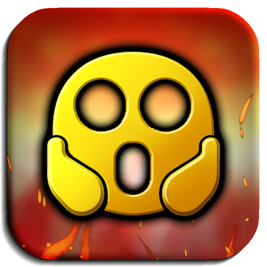

# [](https://geode-sdk.org/mods/cubicstudios.horriblemenu) Horrible Menu
A plethora of ways to ruin your experience...

> [](../../releases/) [](LICENSE.md)
>  
> [](https://geode-sdk.org/mods/cubicstudios.horriblemenu)

> [!TIP]
> *This mod has settings you can utilize to customize your experience.*

---

## About
This silly lil' mod adds a funny mod menu filled to the brim with **over 30 crazy troll options** to mess around with! Spice up your gameplay by adding some truly terrible features to absolutely wreck your entire game.

---

### Options
When pressing `\` or by pressing the floating ** button on your screen, a menu will pop up with a list of joke mod options you can toggle anytime on your game to do some interesting things to it. You can view more information within the menu itself.

> [!NOTE]
> *You can customize any keybinds in this mod through its settings.*

#### Player Life
Give the player a limited health-like meter that must always stay above 0 to prevent the player from dying.

#### Jumpscares
Typically give a chance to teleport you to a whole different level, mid-level. Boo. Haha.

#### Randoms
Minor but possibly devastating inconveniences that just pop in from time to time.

#### Chances
Trolls that usually happen on some sort of player interaction.

#### Obstructive
Disturb the player's accessibility to the gameplay.

#### Misc
Probably the worst of it all...

> [!WARNING]
> *Please keep in mind that certain game settings and hacks from mod menus may interfere with some parts of this mod's functionality.*

### Safe Mode
By default, this mod implements its own safe mode to prevent accidental progression in levels. Remember, **using this mod counts as cheating**! You can also disable this in the mod's settings while you're not actively using any horrible options.

---

### Developers
Want to add your own insane stuff to this mod? You can register your very own horrible options by using this mod's API! You can see its [documentation here](./include). We're hyped to see how much more you can really mess up this game.

```cpp
using namespace horrible;

static constexpr auto id = "my-option"_spr;

static auto const opt = Option::create(id)
    .setName("My Very Cool Option!");
    .setDescription("This option is so very cool!");
    .setCategory("Cool Options");
    .setSillyTier(SillyTier::Medium);
HORRIBLE_REGISTER_OPTION(opt);

class $modify(MyPlayLayer, PlayLayer) {
    HORRIBLE_DELEGATE_HOOKS(id);

    // a vanilla hook
    void setupHasCompleted() {
        PlayLayer::setupHasCompleted();

        // do insane stuff with my option!
    };
};
```

> [!NOTE]
> *If you plan on publishing a mod that acts as an add-on, all we ask is to please be sure to follow the safe code practices as instructed in the [documentation](./include) to the best of your ability!*

---

### Thanks
- **[Geode SDK](https://geode-sdk.org/)**: Created an incredible SDK to make this mod possible!
- **[RobTop Games](https://www.robtopgames.com/)**: Made [Geometry Dash](https://youtu.be/k90y6PIzIaE)...

*and...*

- **You!**: For being there and keeping us motivated to continue this big ole' project.

---


---

### Developers
###### This mod is developed and maintained by **[Cubic Studios](https://www.cubicstudios.xyz/)**, and members and collaborators of the [ Breakeode](https://breakeode.cubicstudios.xyz/) team.