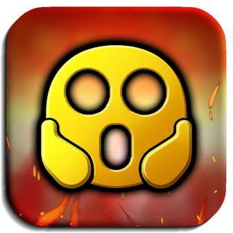
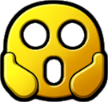
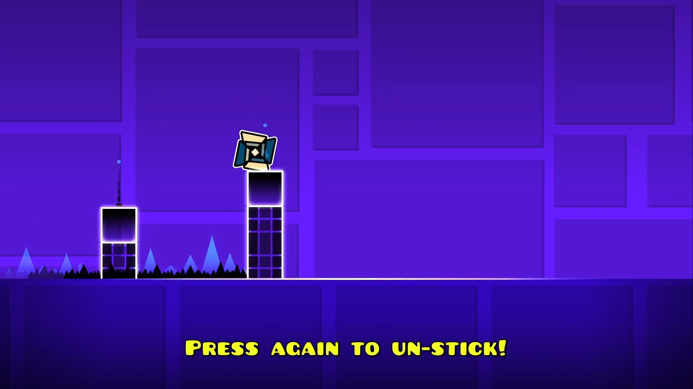
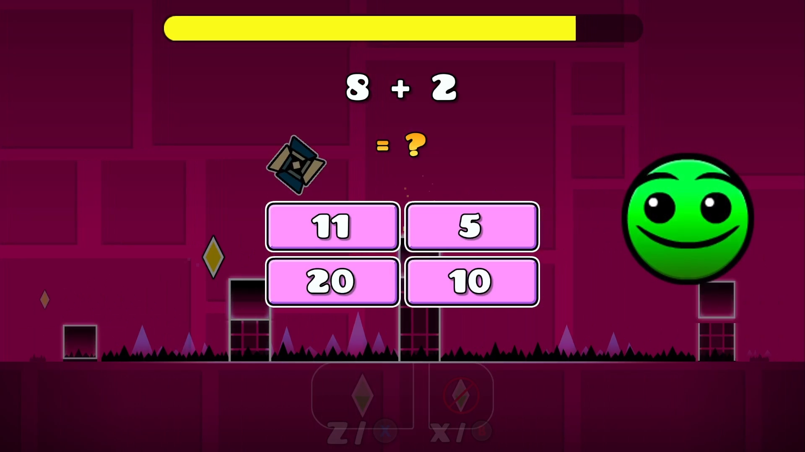
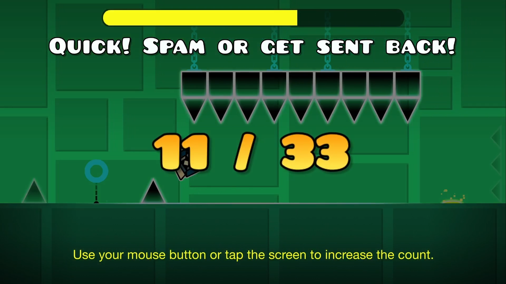
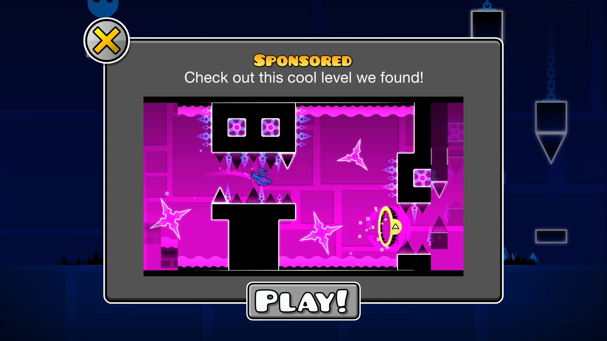
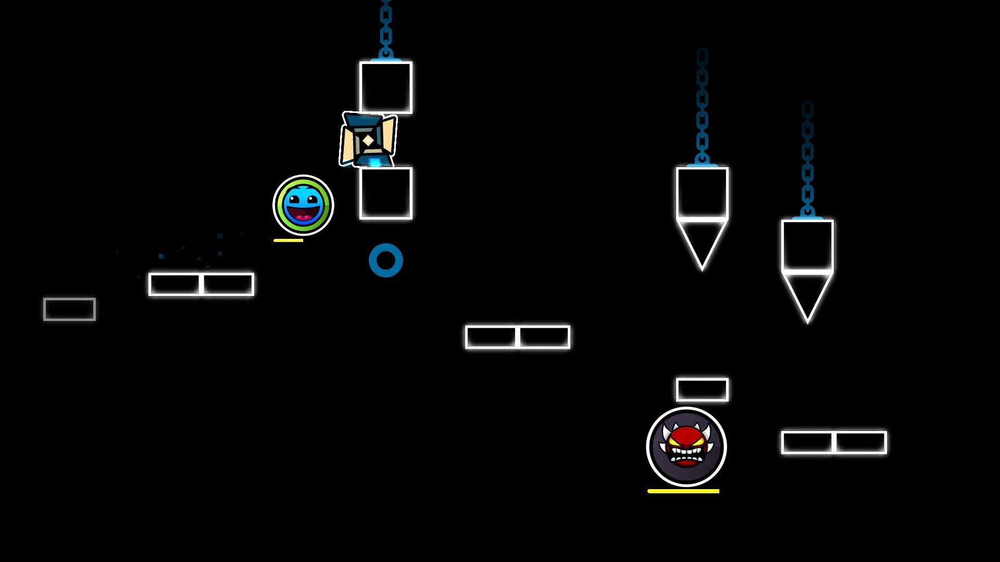

<div align="center">
<h1><a href="https://geode-sdk.org/mods/cubicstudios.horriblemenu"></a> Horrible Menu</h1>
<h6>A plethora of ways to ruin your experience...</h6>


</div>

## About
This silly lil' mod adds a funny mod menu filled to the brim with **over 40 crazy troll options** to mess around with! Spice up your gameplay by adding some truly insane features to absolutely wreck your entire game.

---

### Options
When pressing `\` or by pressing the floating ** button on your screen, a menu will pop up with a list of joke mod options you can toggle anytime on your game to do some interesting things to it. You can view more information within the menu itself.

> [!NOTE]
> *You can customize any keybinds in this mod through its settings.*

### Safe Mode
By default, this mod implements its own safe mode system to prevent making accidental progression in levels while this mod is active. Remember, **using this mod may count as cheating**! You can also disable this in the mod's settings while you're not actively using any troll options.

> [!WARNING]
> *Please keep in mind that certain game settings and hacks from mod menus may interfere with some parts of this mod's functionality.*

---

### Integrations
Want to add your own insane stuff to this mod? You can register your very own troll options by using this mod's API! You can find its [documentation in the Wiki](../../wiki/). We're hyped to see how much more you can really mess up this game.

```cpp
using namespace horrible;

static auto const opt = Option::create("my-option"_spr)
    ->setName("My Very Cool Option!");
    ->setDescription("This option is so very cool!");
    ->setCategory("Cool Options");
    ->setSillyTier(SillyTier::Medium);

HORRIBLE_REGISTER_OPTION(opt);

class $modify(MyPlayLayer, PlayLayer) {
    HORRIBLE_DELEGATE_HOOKS("my-option"_spr);

    // a vanilla function hook
    void setupHasCompleted() {
        PlayLayer::setupHasCompleted();

        // do evil stuff with my option!
    };
};
```

> [!TIP]
> *If you plan on publishing **a mod that acts as an add-on**, all we ask is to please be sure to follow the safe code practices as instructed in the [documentation](../../wiki/) to the best of your ability!*

---

#### Thanks
- **[Cheeseworks](https://www.github.com/BlueWitherer/)**: Internals, API/DX, UI/UX, options' features, mod branding
- **[ArcticWoof](https://www.github.com/DumbCaveSpider/)**: UI, options' features, Horrible Menu logo

*as well as...*

- **[Geode SDK](https://geode-sdk.org/)**: Created an incredible SDK that made this mod possible!
- **[RobTop Games](https://www.robtopgames.com/)**: Made [Geometry Dash](https://youtu.be/k90y6PIzIaE)...

*and...*

- **[You](../../stargazers)!**: For being there and keeping us motivated to continue this big ole' project.

---







---

<div align="center">
This mod is published by <b><a href="https://www.cubicstudios.xyz/"> Cubic Studios</a></b>, on behalf of the <a href="https://breakeode.cubicstudios.xyz/"> Breakeode</a> developer team.
</div>